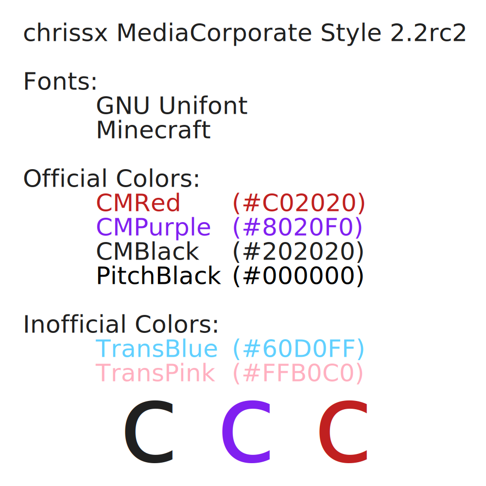

# Designs

Many designs from chrissx Media and resources for those.

## Dependencies

For rebuilding all of the logos you need the following software packages:

- `make`
- `python3`
- `slimrb` (`gem install slim`)
- Inkscape (pre-1.0 versions need custom hacks)
- GIMP

Additionally you need our official fonts:

- [Unifont](http://www.unifoundry.com/unifont/index.html)
- Minecraft (an official source is to be determined)

## Building

Remove the old build files and run `make -j$(nproc)`. Then open up all the GIMP
files and export them.

Running `make` might require custom configuration, like with `inkscape` < 1.0:
`INKSCAPE="inkscape -d 384 -e" make`

## Style guide



## A Rant about GIMP Scripting

Scripting GIMP is horribly broken (at least on macOS), but thankfully you can
use `xcftools`:

```sh
CFLAGS=-I/opt/homebrew/include LDFLAGS="-L/opt/homebrew/lib -lintl" ./configure --prefix=$HOME/.local
make -j8 install
```

But they don't support xcf11…

So you will have to export from GIMP yourself.
